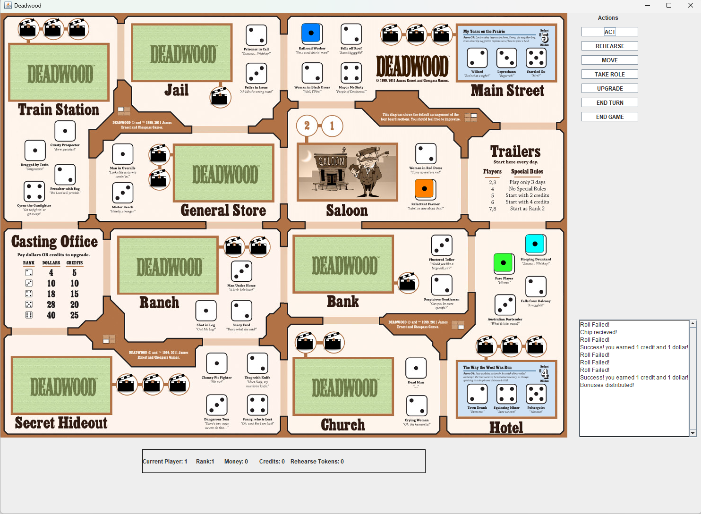

# Deadwood

This project is a digital implementation of the popular tabletop board game Deadwood.

You're a hardworking bit actor in this board game about making cowboy movies. Say your lines right, fall off a few roofs, and you just might be a star!

The game is built in Java, and utilizes the Java Swing library for the GUI.
The full set of rules can be viewed here: 
[text](Deadwood-Rules.pdf)

# Running the Game
First, ensure you have a recent version of Java installed
Then, simply compile all the java files using

javac *.java

And finally, run the game with

java Deadwood

